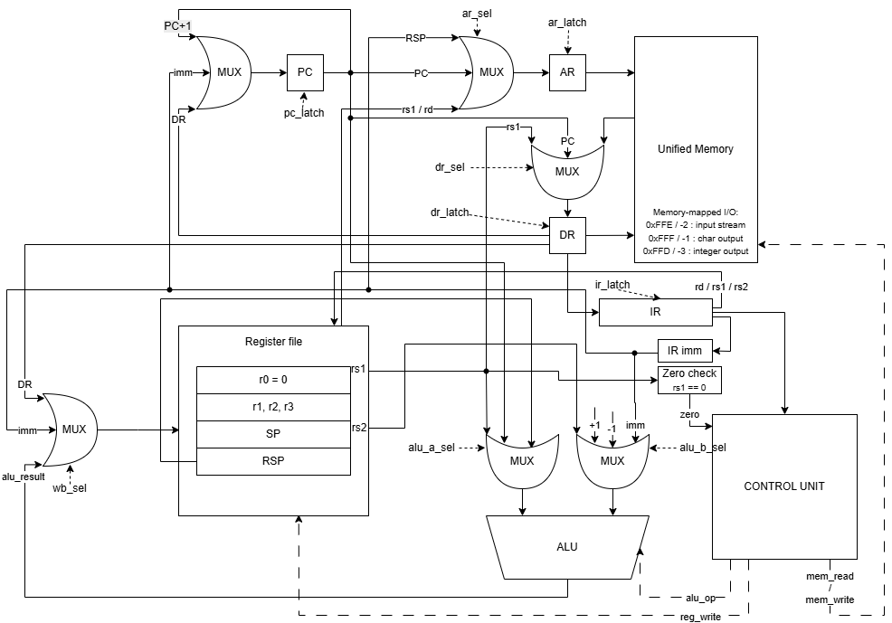
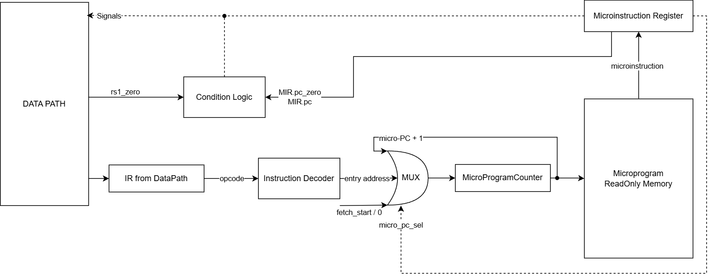

# Отчёт по лабораторной работе №4

- ФИО: `Мельник Фёдор Александрович`
- Группа: `P3206`
- Вариант из ведомости: `forth | risc | neum | mc | tick | binary | stream | mem | cstr | alg1 | pipeline`
- Цель реализации: базовая часть на 30 баллов; усложнение `pipeline` не реализуется.

## Язык программирования Forth

Язык представляет собой минимальный Forth-подобный язык с обратной польской нотацией. Все вычисления на уровне языка выполняются через стек данных. Транслятор отображает стековые операции языка на RISC-инструкции, которые работают с регистрами и памятью.

Форма Бэкуса — Наура:

```text
<program>    ::= <definition>* <word>*
<definition> ::= ":" <name> <word>* ";"
<word>       ::= <number>
               | <string>
               | <builtin>
               | <name>
               | "'" <name>

<number>     ::= ["-"] <digit>+
<string>     ::= '"' <char>* '"' | '."' <char>* '"'
<builtin>    ::= "+" | "-" | "*" | "/" | "mod"
               | "=" | ">" | "<"
               | "dup" | "drop" | "swap" | "over"
               | "if" | "else" | "then"
               | "begin" | "until" | "again"
               | "key" | "emit" | "." | "@" | "!"
               | "puts" | "execute" | "ret"
```

Особенности семантики:

- числа кладутся на стек данных;
- арифметические операции снимают два верхних значения и кладут результат;
- `key` читает один символ из входного потока;
- `emit` выводит символ, `.` выводит число;
- `@` и `!` выполняют косвенное чтение/запись памяти;
- `: name ... ;` определяет процедуру;
- вызов процедуры выполняется словом с её именем;
- `' name` кладёт на стек execution token — адрес процедуры;
- `execute` вызывает процедуру по execution token;
- строки имеют формат C-string: символы по одному машинному слову и завершающий `0`.

Пример:

```forth
: square dup * ;
5 square .
6 ' square execute .
```

## Организация памяти

- Архитектура памяти: фон Неймана (`neum`).
- Память однопортовая, инструкции и данные хранятся в одном массиве машинных слов.
- Машинное слово: 32 бита. Арифметика и записи в регистры/память выполняются с 32-битным переполнением.
- Адресация памяти — по машинным словам.
- Инструкции хранятся как 32-битные беззнаковые слова, данные интерпретируются как знаковые 32-битные значения в дополнительном коде.

Размещение в памяти:

```text
0                      начало машинного кода
...                    инструкции основной программы
...                    инструкции процедур
code_words             статические данные, включая C-strings
1024                   начало стека данных (SP)
2048                   начало стека возвратов (RSP)
0xFFD / -3             memory-mapped числовой вывод
0xFFE / -2             memory-mapped ввод
0xFFF / -1             memory-mapped символьный вывод
```

Пользовательские ячейки-переменные не являются отдельной областью памяти, автоматически управляемой транслятором. В языке нет именованных переменных: слова `@` и `!` читают и записывают машинное слово по числовому адресу, который программист кладёт на стек. Поэтому адреса вроде `800`, `820`, `900`, `901` в примерах используются как статические ячейки данных пользователя. Эти ячейки должны выбираться так, чтобы не пересекаться с:

- машинным кодом и процедурами: `[0; code_words)`;
- статическими данными транслятора, включая строки и крупные литералы: `[code_words; data_end)`;
- стеком данных, который стартует с `SP = 1024` и растёт вверх;
- стеком возвратов, который стартует с `RSP = 2048` и растёт вверх;
- memory-mapped I/O адресами `0xFFD`, `0xFFE`, `0xFFF`.

Практическое правило для тестовых программ: пользовательские статические ячейки размещаются в диапазоне ниже `1024`, но выше конца code/data-секции. В примерах используется область примерно `800..999`, потому что сгенерированный код и статические данные занимают меньшие адреса, а стек данных начинается с `1024`. Если программа станет настолько большой, что code/data-секция дойдёт до выбранных адресов, или если стек вырастет в соседнюю область по ошибке программы, данные могут быть перезаписаны. Транслятор проверяет только кодируемость адресов и литералов, но не доказывает отсутствие пересечений пользовательских ячеек с кодом, статическими данными и стеками; это является соглашением программы и обязанностью программиста.

Регистры процессора:

| Регистр | Назначение |
|---------|------------|
| `R0`    | постоянный ноль |
| `R1`    | временный регистр / результат |
| `R2`    | временный регистр / второй операнд |
| `R3`    | временный регистр, часто константа `1` |
| `SP`    | указатель стека данных |
| `RSP`   | указатель стека возвратов |

Стек языка Forth не является отдельной ISA-архитектурой процессора. Он реализован в памяти через `SP`. Это сохраняет вариант `risc`: арифметика выполняется только между регистрами, а обращения к памяти выполняются отдельными командами `LD` и `ST`.

Литералы с диапазоном `[-2048; 2047]` кодируются непосредственной адресацией через `LDI`. Более крупные целочисленные литералы транслятор размещает в статической области данных после кода и генерирует `LDI address; LD`, чтобы значение не обрезалось до 12 бит. Адреса строк и таких литералов патчатся после определения размера code-секции. Если адрес data-секции не помещается в 12-битный immediate, транслятор выдаёт ошибку, а не генерирует некорректный код.

## Система команд

Система команд соответствует RISC-подходу:

- все инструкции имеют фиксированную длину 32 бита;
- арифметика и сравнения работают только с регистрами;
- доступ к памяти выполняется только через `LD` и `ST`;
- ввод-вывод реализован через memory-mapped адреса и обычные команды памяти.

Формат инструкции:

```text
31              24 23   20 19   16 15   12 11             0
+----------------+-------+-------+-------+----------------+
| opcode: 8 bit  | rd:4  | rs1:4 | rs2:4 | imm: 12 bit    |
+----------------+-------+-------+-------+----------------+
```

`imm` — знаковое 12-битное значение. Машинный код сохраняется в настоящий бинарный файл, а рядом формируется человекочитаемый `.hex` dump.

### Набор инструкций

| Инструкция | Семантика | Такты полного цикла |
|------------|-----------|---------------------|
| `NOP` | нет операции | 4 |
| `LDI rd, imm` | `rd <- imm` | 4 |
| `ADD rd, rs1, rs2` | `rd <- rs1 + rs2` | 4 |
| `SUB rd, rs1, rs2` | `rd <- rs1 - rs2` | 4 |
| `MUL rd, rs1, rs2` | `rd <- rs1 * rs2` | 4 |
| `DIV rd, rs1, rs2` | `rd <- rs1 / rs2` | 4 |
| `MOD rd, rs1, rs2` | `rd <- rs1 % rs2` | 4 |
| `CMP_EQ rd, rs1, rs2` | `rd <- int(rs1 == rs2)` | 4 |
| `CMP_GT rd, rs1, rs2` | `rd <- int(rs1 > rs2)` | 4 |
| `CMP_LT rd, rs1, rs2` | `rd <- int(rs1 < rs2)` | 4 |
| `LD rd, rs1` | `rd <- MEM[rs1]` | 6 |
| `ST rd, rs1` | `MEM[rd] <- rs1` | 6 |
| `JMP imm` | `PC <- imm` | 4 |
| `JZ rs1, imm` | если `rs1 == 0`, то `PC <- imm` | 4 |
| `CALL imm` | сохранить `PC`, перейти на `imm` | 7 |
| `CALLR rs1` | сохранить `PC`, перейти по адресу из `rs1` | 9 |
| `RET` | восстановить `PC` из стека возвратов | 7 |
| `HLT` | остановка процессора | 4 |

Полный цикл включает 3 микротакта выборки (`AR <- PC`, `DR <- MEM[AR]`, `IR <- DR; PC <- PC + 1`) и микротакты исполнения выбранной микропрограммы.

## Ввод-вывод

Вариант ввода-вывода: `stream | mem`.

Ввод — поток символов. При чтении из адреса `-2` модель забирает следующий символ из входного буфера. Если буфер пуст, моделирование останавливается с причиной `input_stream_empty`.

Вывод отображён в память:

| Адрес | Назначение |
|-------|------------|
| `-2` / `0xFFE` | ввод символа |
| `-1` / `0xFFF` | вывод символа |
| `-3` / `0xFFD` | вывод числа |

Специальных инструкций `IN`/`OUT` нет: ввод-вывод выполняется штатными `LD` и `ST`, что соответствует варианту `mem`.

## Микрокод и тактовая модель

Control Unit является микропрограммным (`mc`). Микрокод хранится отдельно от основной памяти программы в `MICROCODE_ROM`. Модель исполняет не инструкцию целиком, а последовательность микроинструкций. Один вызов `tick()` выполняет ровно одну микроинструкцию.

Микроинструкция реализована как слово управляющих сигналов, а не как Python-callback. Это важно для варианта `mc`: `ControlUnit` интерпретирует поля микроинструкции так же, как аппаратный CU выдаёт сигналы на DataPath.

```python
@dataclass(frozen=True)
class MicroInstruction:
    name: str
    ar_src: ArSource | None = None
    ar_latch: bool = False
    dr_src: DrSource | None = None
    dr_latch: bool = False
    ir_latch: bool = False
    mem_read: bool = False
    mem_write: bool = False
    reg_target: RegTarget | None = None
    reg_write: bool = False
    wb_src: WbSource | None = None
    alu_a_src: AluASource | None = None
    alu_b_src: AluBSource | None = None
    alu_op: Opcode | None = None
    pc_src: PcSource | None = None
    pc_latch: bool = False
    pc_condition: PcCondition = PcCondition.ALWAYS
    halt: bool = False
    next_micro: NextMicro = NextMicro.SEQ
```

Основные регистры DataPath и Control Unit:

| Регистр | Где находится | Назначение |
|---------|---------------|------------|
| `PC` | DataPath | адрес следующей инструкции |
| `IR` | DataPath | текущая машинная инструкция |
| `AR` | DataPath | адресный регистр памяти |
| `DR` | DataPath | регистр данных памяти |
| `MIR` | ControlUnit | текущая микроинструкция из microprogram ROM |
| `micro_pc` | ControlUnit | адрес микроинструкции внутри микропрограммы |

Общий цикл исполнения:

```text
fetch_ir_from_mem_pc
    AR <- PC
fetch_memory_word_to_dr
    DR <- MEM[AR]
latch_ir_increment_pc_decode
    IR <- DR
    PC <- PC + 1
    micro_pc <- entry address from instruction decoder

execute microinstruction 1
execute microinstruction 2
...
```

Основные микропрограммы:

| Opcode | Микропрограмма |
|--------|----------------|
| `ADD/SUB/MUL/DIV/MOD/CMP_*` | `alu_rs1_rs2_to_rd` |
| `LDI` | `write_imm_to_rd` |
| `LD` | `load_address_rs1_to_ar`, `load_memory_word_to_dr`, `load_dr_to_rd` |
| `ST` | `store_address_rd_to_ar`, `store_rs1_to_dr`, `store_dr_to_memory` |
| `JMP` | `pc_from_imm` |
| `JZ` | `pc_from_imm_if_rs1_zero` |
| `CALL` | `call_address_rsp_to_ar`, `call_return_pc_to_dr`, `call_store_return_pc`, `call_increment_rsp_and_jump_imm` |
| `CALLR` | `callr_address_rsp_to_ar`, `callr_return_pc_to_dr`, `callr_store_return_pc`, `callr_increment_rsp`, `callr_target_rs1_to_dr`, `callr_pc_from_dr` |
| `RET` | `ret_decrement_rsp`, `ret_address_rsp_to_ar`, `ret_memory_word_to_dr`, `ret_pc_from_dr` |
| `HLT` | `halt` |

Журнал микротактов содержит не только имя микроинструкции, но и активные сигналы (`ar_sel`, `dr_sel`, `mem_read`, `mem_write`, `reg_write`, `pc_sel`, `alu_op`). Это позволяет проверить, что симулятор работает на уровне микротактов и сигналов, а не исполняет инструкции как атомарные Python-функции.

Pipeline в реализации отсутствует: нет стадий IF/ID/EX, регистров конвейера, hazard detection, stall/flush и параллельного исполнения инструкций.

## Транслятор

Интерфейс командной строки:

```bash
python translator.py <source.frt> <output.bin>
```

Результат:

- `<output.bin>` — бинарный машинный код;
- `<output.bin>.hex` — отладочный dump машинного кода.

Этапы трансляции:

1. Токенизация исходного Forth-кода.
2. Выделение процедур вида `: name ... ;`.
3. Генерация RISC-инструкций для основной программы.
4. Генерация кода процедур после основной программы.
5. Размещение C-string литералов и крупных числовых литералов в секции данных после кода.
6. Патчинг адресов процедур, execution token, строк и literal pool.
7. Запись бинарного файла и `.hex`-лога.

Стековые операции Forth транслируются через `LD/ST` и регистр `SP`. Например, `push` значения — это запись в `MEM[SP]` и инкремент `SP`; `pop` — декремент `SP` и чтение из `MEM[SP]`.

## Модель процессора

Интерфейс командной строки:

```bash
python machine.py <code.bin> <input.txt> [--log trace.txt] [--trace-head N] [--max-ticks N]
```

Модель разделена на две части:

- `DataPath`: память, регистры, ALU, буферы ввода-вывода, а также аппаратные регистры `PC`, `IR`, `AR`, `DR`;
- `ControlUnit`: `MIR`, `micro_pc`, выборка микроинструкций из `MICROCODE_ROM`, декодирование opcode и выдача управляющих сигналов.

При запуске бинарный код загружается в общую память с адреса `0`. Затем инициализируются `SP = 1024` и `RSP = 2048`. Симулятор выполняет микротакты до `HLT`, пустого ввода или достижения лимита тактов. Если указан `--log`, в файл записывается репрезентативный журнал микротактов с регистрами и активными сигналами.

### Схема DataPath



### Схема Control Unit



## Тестирование

Golden-тесты находятся в каталоге `golden/` в формате `.yml`. Программы для ручного запуска лежат в `examples/`.

Каждый golden-тест содержит:

- `in_source` — исходный код программы;
- `in_input` — входной stream;
- `out_stdout` — ожидаемый вывод;
- `out_log` — репрезентативный журнал микротактов;
- `out_code_log` — dump машинного кода.

Реализованные тесты:

| Тест | Назначение |
|------|------------|
| `hello.frt` | вывод статической C-string |
| `cat.frt` | печать входного потока до EOF |
| `hello_user_name.frt` | запрос имени и приветствие |
| `sort.frt` | сортировка входной строки digit-чисел до `\n` |
| `double_precision.frt` | 64-битное сложение с переносом: `0x00000000FFFFFFFF + 1 = 0x0000000100000000`, выводится пара `high low` |
| `euler4.frt` | алгоритм варианта `alg1`, Project Euler 4 |
| `features.frt` | процедуры и execution token |

Запуск тестов:

```bash
pytest -v
```

Обновление golden-файлов после намеренного изменения реализации:

```bash
UPDATE_GOLDEN=1 pytest -v
```

## CI, lint и formatter

Для GitHub настроен workflow `.github/workflows/ci.yml`. Он выполняет:

```bash
ruff format --check .
ruff check .
mypy isa.py machine.py translator.py test_golden.py --ignore-missing-imports
pytest -v
```

Formatter нужен для единого оформления кода. Linter нужен для поиска неиспользуемого кода, подозрительных конструкций и ошибок стиля. `mypy` дополнительно проверяет согласованность типов в трансляторе, ISA и модели процессора.

## Ручной запуск

Пример для `cat`:

```bash
python translator.py examples/cat.frt target.bin
python machine.py target.bin examples/cat.in
```

Пример вывода:

```text
Translation finished.
Output: foo
```

## Особенности и ограничения

- Реализация минимальная и ориентирована на лабораторную работу, а не на промышленный Forth.
- Строки хранятся как C-string: один символ в одном машинном слове и завершающий ноль.
- Ввод потенциально бесконечен; окончание входного stream останавливает модель.
- `euler4.frt` использует оптимизацию: один из множителей шестизначного палиндрома делится на 11. Это уменьшает время работы golden-теста, но не меняет алгоритм поиска максимального палиндрома.
- 64-битные значения в тесте двойной точности представлены парой 32-битных слов `high:low`; это демонстрирует перенос между машинными словами, а не использование Python-числа произвольной точности.
- Усложнение `pipeline` не реализовано и не заявляется к защите на 40 баллов.
