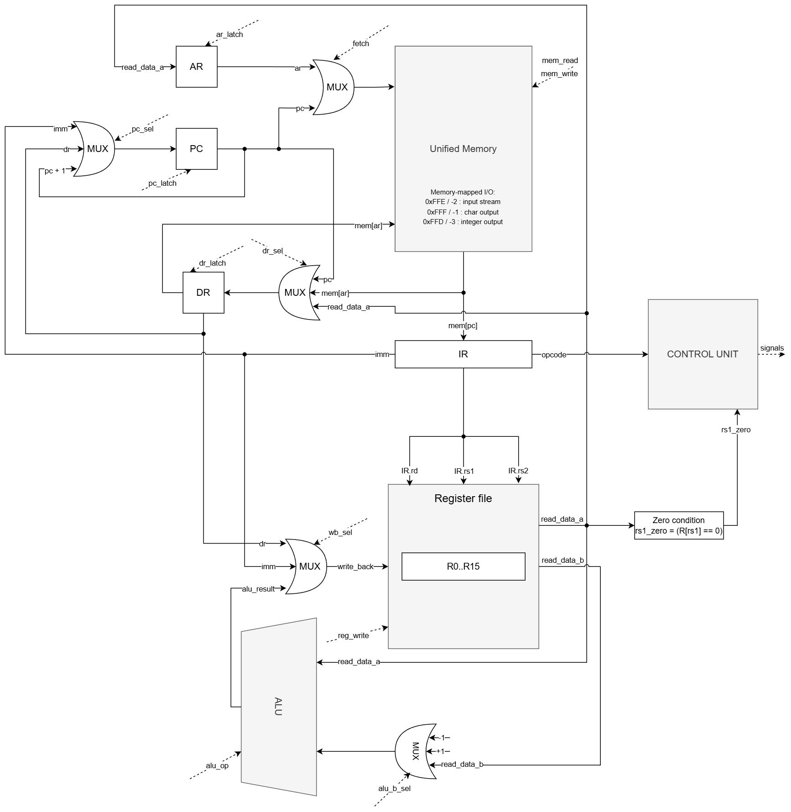

# Отчёт по лабораторной работе №4

- ФИО: `Мельник Фёдор Александрович`
- Группа: `P3206`
- Вариант из ведомости: `forth | risc | neum | mc | tick | binary | stream | mem | cstr | prob1 | pipeline`

## Язык программирования Forth

Язык представляет собой минимальный Forth-подобный язык с обратной польской нотацией. Все вычисления на уровне языка выполняются через стек данных. Транслятор отображает стековые операции языка на RISC-инструкции, которые работают с регистрами и памятью.

Форма Бэкуса — Наура:

```text
<program>       ::= (<definition> | <statement>)*

<definition>    ::= ":" <name> <proc-statement>* ";"

<statement>     ::= <literal>
                  | <builtin>
                  | <call>
                  | <execution-token>
                  | <if-statement>
                  | <loop-statement>

<proc-statement> ::= <statement> | "ret"

<literal>       ::= <number> | <string> | <print-string>
<number>        ::= ["-"] <digit>+
<string>        ::= '"' <char>* '"'
<print-string>  ::= '."' <char>* '"'

<call>          ::= <name>
<execution-token> ::= "'" <name>

<if-statement>  ::= "if" <statement>* ["else" <statement>*] "then"

<loop-statement> ::= "begin" <statement>* "until"
                   | "begin" <statement>* "again"

<builtin>       ::= "+" | "-" | "*" | "/" | "mod"
                  | "=" | ">" | "<"
                  | "dup" | "drop" | "swap" | "over"
                  | "key" | "emit" | "." | "@" | "!"
                  | "puts" | "execute"

<name>          ::= <name-char>+
<name-char>     ::= any non-whitespace character except '"', "(", ")"
                  and except reserved words and delimiters
<digit>         ::= "0" | "1" | "2" | "3" | "4" | "5" | "6" | "7" | "8" | "9"
<char>          ::= any character except '"' and "\"
                  | "\\" ("n" | "t" | '"' | "\\")
```

Особенности семантики:

- числа кладутся на стек данных;
- арифметические операции снимают два верхних значения и кладут результат;
- `key` читает один символ из входного потока;
- `emit` выводит символ, `.` выводит число;
- `@` и `!` выполняют косвенное чтение/запись памяти;
- `: name ... ;` определяет процедуру;
- вызов процедуры выполняется словом с её именем;
- `' name` кладёт на стек execution token — адрес процедуры;
- `execute` вызывает процедуру по execution token;
- строки имеют формат C-string: символы по одному машинному слову и завершающий `0`.

Пример:

```forth
: square dup * ;
5 square .
6 ' square execute .
```
Комментарии игнорируются лексером:
- "\\" начинает комментарий до конца строки;
- "(" ... ")" задаёт однострочный/линейный комментарий до ближайшей закрывающей скобки.

Все слова языка разделяются пробельными символами. Поэтому "'", ":", ";" являются отдельными токенами и должны отделяться пробелами от соседних слов.


## Организация памяти

- Архитектура памяти: фон Неймана (`neum`).
- Память однопортовая, инструкции и данные хранятся в одном массиве машинных слов.
- Машинное слово: 32 бита. Арифметика и записи в регистры/память выполняются с 32-битным переполнением.
- Адресация памяти — по машинным словам.
- Инструкции хранятся как 32-битные беззнаковые слова, данные интерпретируются как знаковые 32-битные значения в дополнительном коде.

Размещение в памяти:

```text
0                      начало машинного кода
...                    инструкции основной программы
...                    инструкции процедур
code_words             статические данные, включая C-strings
1024                   начало стека данных (указатель хранится в R14)
2048                   начало стека возвратов (указатель хранится в R15)
0xFFD / -3             memory-mapped числовой вывод
0xFFE / -2             memory-mapped ввод
0xFFF / -1             memory-mapped символьный вывод
```

Пользовательские ячейки-переменные не являются отдельной областью памяти, автоматически управляемой транслятором. В языке нет именованных переменных: слова `@` и `!` читают и записывают машинное слово по числовому адресу, который программист кладёт на стек. Поэтому адреса вроде `800`, `820`, `900`, `901` в примерах используются как статические ячейки данных пользователя. Эти ячейки должны выбираться так, чтобы не пересекаться с:

- машинным кодом и процедурами: `[0; code_words)`;
- статическими данными транслятора, включая строки и крупные литералы: `[code_words; data_end)`;
- стеком данных, который стартует с `R14 = 1024` и растёт вверх;
- стеком возвратов, который стартует с `R15 = 2048` и растёт вверх;
- memory-mapped I/O адресами `0xFFD`, `0xFFE`, `0xFFF`.

Практическое правило для тестовых программ: пользовательские статические ячейки размещаются в диапазоне ниже `1024`, но выше конца code/data-секции. В примерах используется область примерно `800..999`, потому что сгенерированный код и статические данные занимают меньшие адреса, а стек данных начинается с `1024`. Если программа станет настолько большой, что code/data-секция дойдёт до выбранных адресов, или если стек вырастет в соседнюю область по ошибке программы, данные могут быть перезаписаны. Транслятор проверяет только кодируемость адресов и литералов, но не доказывает отсутствие пересечений пользовательских ячеек с кодом, статическими данными и стеками; это является соглашением программы и обязанностью программиста.

Регистры процессора организованы как единый регистровый файл `R0..R15`. Поля инструкции `rd`, `rs1`, `rs2` содержат номера регистров, а на входы ALU поступают значения, считанные из регистрового файла по этим адресам. Поле `rd` задаёт адрес записи результата через шину `write_back`.

`R0` аппаратно связан с нулём: чтение `R0` всегда возвращает `0`, а запись в `R0` игнорируется. Такой регистр нужен для простого получения нулевого операнда и для условного перехода `JZ`, где значение `Reg[rs1]` сравнивается с `Reg[R0]`. Остальные регистры являются записываемыми регистрами общего назначения.

В ISA нет отдельных аппаратных типов регистров вроде `SP` или `RSP`. В реализации Forth используется только соглашение транслятора:

| Регистр | Соглашение транслятора |
|---------|-------------------------|
| `R0`    | аппаратный ноль, запись игнорируется |
| `R1`    | временный регистр / результат |
| `R2`    | временный регистр / второй операнд |
| `R3`    | временный регистр, часто константа `1` |
| `R4..R13` | свободные регистры общего назначения |
| `R14`   | указатель стека данных Forth |
| `R15`   | указатель стека возвратов Forth |

`R14` и `R15` не являются отдельными аппаратными регистрами с иной структурой. Это ячейки того же регистрового файла, которые Control Unit выбирает как фиксированные адреса в микрокоде `CALL`/`RET`, а транслятор использует по соглашению. Такой выбор нужен только для runtime Forth; арифметические инструкции по-прежнему работают с произвольными регистрами через поля `rd`, `rs1`, `rs2`.

Стек языка Forth не является отдельной ISA-архитектурой процессора. Он реализован в памяти через `R14`. Это сохраняет вариант `risc`: арифметика выполняется только между регистрами, а обращения к памяти выполняются отдельными командами `LD` и `ST`.

Литералы с диапазоном `[-2048; 2047]` кодируются непосредственной адресацией через `LDI`. Более крупные целочисленные литералы транслятор размещает в статической области данных после кода и генерирует `LDI address; LD`, чтобы значение не обрезалось до 12 бит. Адреса строк и таких литералов патчатся после определения размера code-секции. Если адрес data-секции не помещается в 12-битный immediate, транслятор выдаёт ошибку, а не генерирует некорректный код.

## Система команд

Система команд соответствует RISC-подходу:

- все инструкции имеют фиксированную длину 32 бита;
- арифметика и сравнения работают только с регистрами;
- доступ к памяти выполняется только через `LD` и `ST`;
- ввод-вывод реализован через memory-mapped адреса и обычные команды памяти.

Формат инструкции:

```text
31              24 23   20 19   16 15   12 11             0
+----------------+-------+-------+-------+----------------+
| opcode: 8 bit  | rd:4  | rs1:4 | rs2:4 | imm: 12 bit    |
+----------------+-------+-------+-------+----------------+
```

`imm` — знаковое 12-битное значение. Машинный код сохраняется в настоящий бинарный файл, а рядом формируется человекочитаемый `.hex` dump.

### Набор инструкций

| Инструкция | Семантика | Такты полного цикла |
|------------|-----------|---------------------|
| `NOP` | нет операции | 2 |
| `LDI rd, imm` | `rd <- imm` | 2 |
| `ADD rd, rs1, rs2` | `rd <- rs1 + rs2` | 2 |
| `SUB rd, rs1, rs2` | `rd <- rs1 - rs2` | 2 |
| `MUL rd, rs1, rs2` | `rd <- rs1 * rs2` | 2 |
| `DIV rd, rs1, rs2` | `rd <- rs1 / rs2` | 2 |
| `MOD rd, rs1, rs2` | `rd <- rs1 % rs2` | 2 |
| `CMP_EQ rd, rs1, rs2` | `rd <- int(rs1 == rs2)` | 2 |
| `CMP_GT rd, rs1, rs2` | `rd <- int(rs1 > rs2)` | 2 |
| `CMP_LT rd, rs1, rs2` | `rd <- int(rs1 < rs2)` | 2 |
| `LD rd, rs1` | `rd <- MEM[rs1]` | 4 |
| `ST rd, rs1` | `MEM[rd] <- rs1` | 3 |
| `JMP imm` | `PC <- imm` | 2 |
| `JZ rs1, imm` | если `rs1 == 0`, то `PC <- imm` | 2 |
| `CALL imm` | сохранить `PC`, перейти на `imm` | 3 |
| `CALLR rs1` | сохранить `PC`, перейти по адресу из `rs1` | 4 |
| `RET` | восстановить `PC` из стека возвратов | 5 |
| `HLT` | остановка процессора | 2 |

Полный цикл включает микротакт выборки (`IR <- MEM[PC]`, `PC <- PC + 1`) и микротакты исполнения выбранной микропрограммы. Ветвления не требуют отдельной логики сброса: после fetch `PC` содержит адрес следующей инструкции по умолчанию, а микрокоманда `JMP`/`JZ` при необходимости перезаписывает `PC` целевым адресом.

## Ввод-вывод

Вариант ввода-вывода: `stream | mem`.

Ввод - поток символов. При чтении из адреса `-2` модель забирает следующий символ из входного буфера. Если буфер пуст, моделирование останавливается с причиной `input_stream_empty`.

Вывод отображён в память:

| Адрес | Назначение |
|-------|------------|
| `-2` / `0xFFE` | ввод символа |
| `-1` / `0xFFF` | вывод символа |
| `-3` / `0xFFD` | вывод числа |

Специальных инструкций `IN`/`OUT` нет: ввод-вывод выполняется `LD` и `ST`, что соответствует варианту `mem`.

## Микрокод и тактовая модель

Основная память программы и данных не содержит микрокод: управляющие слова находятся отдельно, в `microcode.py`, в массиве `MICROCODE_ROM`.

В модели есть два регистра уровня CU:

| Регистр | Назначение |
|---------|------------|
| `micro_pc` | адрес текущей микрокоманды в `MICROCODE_ROM` |
| `MIR` | 32-битное управляющее слово, считанное из `MICROCODE_ROM` |

Один вызов `tick()` соответствует одному микротакту. За микротакт выполняется текущее управляющее слово, затем выбирается следующий `micro_pc`.

Микрокод хранится как плоский массив чисел:

```python
MICROCODE_ROM: tuple[int, ...]
DECODER: tuple[int, ...]  # opcode -> адрес первой микрокоманды
```

Функция `encode(...)` используется только при заполнении массива: она упаковывает поля управляющего слова в одно целое число. Во время моделирования исполняются уже числа из `MICROCODE_ROM`, а не объекты Python.

Формат управляющего слова:

```text
30     fetch            IR <- MEM[PC], PC <- PC + 1
29..27 AR source        0 none, 1 RD, 2 RS1, 3 R15
26..25 DR source        0 none, 1 MEM[AR], 2 PC, 3 RS1
24     IR latch         IR <- DR
23     MEM write        MEM[AR] <- DR
22..21 register target  0 none, 1 RD, 2 R15
20..19 writeback source 0 none, 1 IMM, 2 DR, 3 ALU
18..17 unused
16..15 ALU right source 0 none, 1 RS2, 2 +1, 3 -1
14..11 ALU operation    0 opcode from IR, 1 ADD
10..9  PC source        0 none, 1 PC+1, 2 IMM, 3 DR
8      PC condition     0 always, 1 only if Reg[rs1] == Reg[R0]
7      halt
6..5   next uPC mode    0 uPC+1, 1 fetch, 2 decode opcode
4..0   unused
```

Переход внутри памяти микрокода устроен просто:

| `next` | Следующий `micro_pc` |
|--------|----------------------|
| `0` | `micro_pc + 1` |
| `1` | `0`, начало fetch |
| `2` | `DECODER[opcode]` |

Пример заполнения памяти микрокода:

```python
_mrom[0] = encode(fetch=1, next_=NEXT_DECODE)
_mrom[5] = encode(dst=DST_RD, wb=WB_IMM, next_=NEXT_FETCH)

_decoder[Opcode.LDI] = 5
```

Fetch занимает один микротакт. В этом такте основная память адресуется через `PC`, считанное слово сразу попадает в `IR`, а `PC` увеличивается на единицу:

```text
IR <- MEM[PC]
PC <- PC + 1
micro_pc <- DECODER[opcode]
```

После fetch выполняется микропрограмма конкретной инструкции. Например, `LD` занимает три исполнительных микротакта:

```text
ld_ar_rs1 : AR <- Reg[rs1]
ld_dr_mem : DR <- MEM[AR]
ld_rd_dr  : Reg[rd] <- DR
```

Для `JZ` отдельного регистра флагов нет. DataPath выдаёт в CU статусный сигнал `rs1_zero = (Reg[rs1] == Reg[R0])`. Так как `R0` всегда равен нулю, это проверка `Reg[rs1] == 0`. CU использует этот сигнал только в микрокоманде `jz_rs1_imm`:

```text
if Reg[rs1] == Reg[R0]:
    PC <- imm
```

Основные адреса микропрограмм:

| Opcode | Адрес в `MICROCODE_ROM` | Микропрограмма |
|--------|--------------------------|----------------|
| `NOP` | `3` | `nop` |
| `ADD/SUB/MUL/DIV/MOD/CMP_*` | `4` | `alu_rd_rs1_rs2` |
| `LDI` | `5` | `ldi_rd_imm` |
| `LD` | `6` | `ld_ar_rs1`, `ld_dr_mem`, `ld_rd_dr` |
| `ST` | `9` | `st_prepare`, `st_mem_dr` |
| `JMP` | `12` | `jmp_imm` |
| `JZ` | `13` | `jz_rs1_imm` |
| `CALL` | `14` | `call_prepare_ret`, `call_store_inc_pc` |
| `CALLR` | `18` | `callr_prepare_ret`, `callr_store_inc_target`, `callr_pc_dr` |
| `RET` | `24` | `ret_r15_dec`, `ret_ar_r15`, `ret_dr_mem`, `ret_pc_dr` |
| `HLT` | `28` | `halt` |

В журнале модели для каждого микротакта выводятся `uPC`, значение `MIR` в hex, имя микрокоманды, выполняемая инструкция, активные управляющие поля, состояние регистров и буфер вывода. Запись одного микротакта оформлена несколькими строками с табуляцией, поэтому активные сигналы и регистры можно читать отдельно. По этому журналу можно проверить, что модель идёт именно по микрокомандам.

Схемотехнически fetch реализован через мультиплексор адреса перед единой памятью. При `fetch=1` на адрес памяти подаётся `PC`, в остальных микротактах используется `AR`. Память остаётся однопортовой: за микротакт выполняется только одно обращение к одному адресу.

Pipeline в реализации отсутствует: нет стадий IF/ID/EX, регистров конвейера, hazard detection, stall/flush и параллельного исполнения инструкций.

## Транслятор

Интерфейс командной строки:

```bash
python translator.py <source.frt> <output.bin>
```

Результат:

- `<output.bin>` - бинарный машинный код;
- `<output.bin>.hex` - отладочный dump машинного кода.

Этапы трансляции:

1. Токенизация исходного Forth-кода.
2. Выделение процедур вида `: name ... ;`.
3. Генерация RISC-инструкций для основной программы.
4. Генерация кода процедур после основной программы.
5. Размещение C-string литералов и крупных числовых литералов в секции данных после кода.
6. Патчинг адресов процедур, execution token, строк и literal pool.
7. Запись бинарного файла и `.hex`-лога.

Стековые операции Forth транслируются через `LD/ST` и регистр `R14`. Например, `push` значения - это запись в `MEM[R14]` и инкремент `R14`; `pop` - декремент `R14` и чтение из `MEM[R14]`.

## Модель процессора

Интерфейс командной строки:

```bash
python machine.py <code.bin> <input.txt> [--log trace.txt] [--trace-head N] [--max-ticks N]
```

Модель разделена на две части:

- `DataPath`: память, регистры, ALU, буферы ввода-вывода, а также аппаратные регистры `PC`, `IR`, `AR`, `DR`;
- `ControlUnit`: `MIR`, `micro_pc`, выборка микроинструкций из `MICROCODE_ROM`, декодирование opcode и выдача управляющих сигналов.

При запуске бинарный код загружается в общую память с адреса `0`. Затем инициализируются `R14 = 1024` и `R15 = 2048`. Симулятор выполняет микротакты до `HLT`, пустого ввода или достижения лимита тактов. Если указан `--log`, в файл записывается репрезентативный журнал микротактов с регистрами и активными сигналами.

### Схема DataPath



### Схема Control Unit


## Тестирование

Golden-тесты находятся в каталоге `golden/` в формате `.yml`. Программы для ручного запуска лежат в `examples/`.

Каждый golden-тест содержит:

- `in_source` — исходный код программы;
- `in_input` — входной stream;
- `out_stdout` — ожидаемый вывод;
- `out_log` — репрезентативный журнал микротактов;
- `out_code_log` — dump машинного кода.

Реализованные тесты:

| Тест | Назначение |
|------|------------|
| `hello.frt` | вывод статической C-string |
| `cat.frt` | печать входного потока до EOF |
| `hello_user_name.frt` | запрос имени, чтение ввода в C-string-буфер и приветствие |
| `sort.frt` | сортировка входной строки digit-чисел до `\n` |
| `double_precision.frt` | 64-битное сложение с переносом: `0x00000000FFFFFFFF + 1 = 0x0000000100000000`, выводится пара `high low` |
| `euler4.frt` | алгоритм варианта `alg1`, Project Euler 4 |
| `features.frt` | процедуры и execution token |

Запуск тестов:

```bash
pytest -v
```

Обновление golden-файлов после намеренного изменения реализации:

```bash
UPDATE_GOLDEN=1 pytest -v
```

## CI, lint и formatter

Для GitHub настроен workflow `.github/workflows/ci.yml`. Он выполняет:

```bash
ruff format --check .
ruff check .
mypy isa.py machine.py translator.py test_golden.py --ignore-missing-imports
pytest -v
```

Formatter нужен для единого оформления кода. Linter нужен для поиска неиспользуемого кода, подозрительных конструкций и ошибок стиля. `mypy` дополнительно проверяет согласованность типов в трансляторе, ISA и модели процессора.

## Ручной запуск

Пример для `cat`:

```bash
python translator.py examples/cat.frt target.bin
python machine.py target.bin examples/cat.in
```

Пример вывода:

```text
Translation finished.
Output: foo
```

## Особенности и ограничения

- Реализация минимальная и ориентирована на лабораторную работу, а не на промышленный Forth.
- Строки хранятся как C-string: один символ в одном машинном слове и завершающий ноль.
- В тестах `hello.frt` и `hello_user_name.frt` статические строки размещаются в секции данных, а вывод выполняется рекурсивной процедурой `print-cstr`, написанной на Forth через `@` и `emit`. В `hello_user_name.frt` имя сначала считывается из input stream в C-string-буфер процедурой `read-line-cstr`, завершается нулём, и только после этого печатается приветствие.
- Ввод потенциально бесконечен; окончание входного stream останавливает модель.
- `euler4.frt` использует оптимизацию: один из множителей шестизначного палиндрома делится на 11. Это уменьшает время работы golden-теста, но не меняет алгоритм поиска максимального палиндрома.
- 64-битные значения в тесте двойной точности представлены парой 32-битных слов `high:low`; это демонстрирует перенос между машинными словами, а не использование Python-числа произвольной точности.
- Усложнение `pipeline` не реализовано
